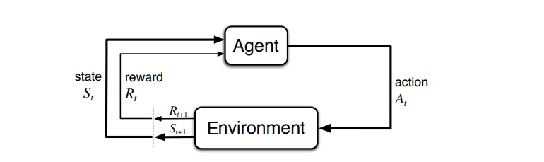
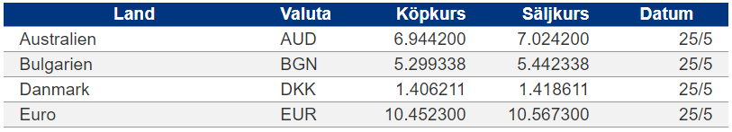
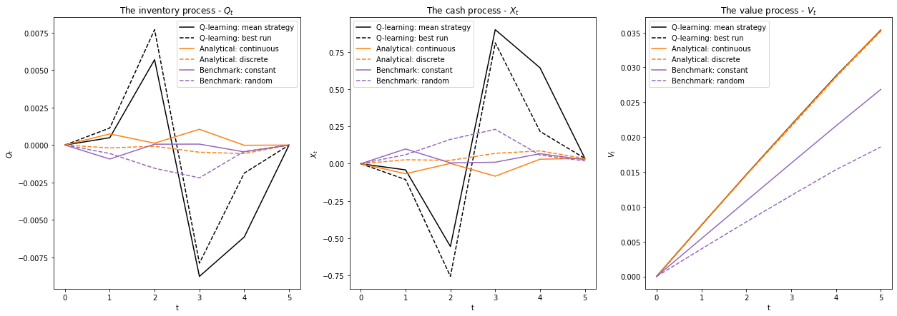
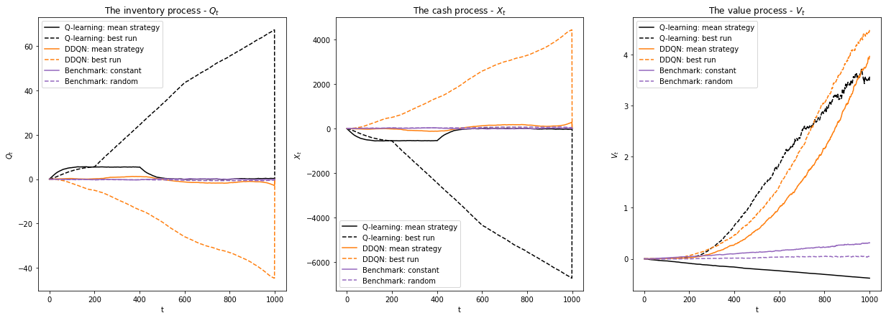

# Reinforcement Learning for Market Making

This is the GitHub repository for our MSc thesis project _Reinforcement Learning for Market Making_ in financial mathematics at KTH Royal Institute of Technology. The thesis was written during the spring of 2022 in collaboration with Skandinaviska Enskilda Banken (SEB) and can be found **[here](https://kth.diva-portal.org/smash/record.jsf?pid=diva2:1695877)**.

In this project, we have used tabular and deep reinforcement learning methods in order to find optimal market making strategies. Continue reading for more!

## What is Reinforcement Learning?
For anyone not familiar with reinforcement learning (RL), it's a concept that stems from the idea of how humans and animals learn: by interacting in an environment and learning from experience. RL has lately gotten a lot of attention, and one of the most famous examples is DeepMind's AlphaGo:

> AlphaGo was the first computer program to beat a world champion in the board game Go. If you haven't seen the documentary about AlphaGo, you should check it out. It's available on Youtube **[here](https://www.youtube.com/watch?v=WXuK6gekU1Y)**. Other cool stuff that has been done is teaching a computer program to play Atari arcade games on a superhuman level (the first example of something called _deep Q-networks_) and DeepMind's AlphaFold. AlphaFold is the world's greatest computer program for protein structure prediction. 

But for what can reinforcement learning be used? It is built upon the assumption that there is an environment an agent can interact with &ndash; most commonly a Markov decision process (MDP). In a decision process, the interaction is as follows:

> At each step *t* the agent (decision-maker):
> * Receives an observation of the current state _S<sub>t</sub>_
> * Executes an action _A<sub>t</sub>_
>
> The environment then:
> * Receives an action _A<sub>t</sub>_
> * Emits an observation of the next state _S<sub>t+1</sub>_ and a reward _R<sub>t+1</sub>_

This interaction is explained by the following image.

<div>
    
</div>

Let's have a look at an example so we better can grasp the concepts.

> We just started playing a game of chess; none of the players have made a move, so the board is in its starting position. Then the state, _S<sub>t</sub>_, is the current board configuration. The agent may then choose to move its leftmost pawn one step forward, which would be its action, _A<sub>t</sub>_. After the agent has made its move, the opponent would make its move. Following this, the agent would have a look at the new board state, _S<sub>t+1</sub>_, and receive a reward _R<sub>t+1</sub>_. This reward could be defined in many different ways, for instance, the value of the opponent's lost pieces minus the value of the agent's lost pieces or the increase in the probability of winning the game.

There are many ways to perform reinforcement learning, but what they have in common is that they at every state want to find the action that maximizes the expected cumulative reward. We have chosen to focus on two different RL methods to find optimal market making strategies: *Q-learning* and *Double Deep Q-Network* (DDQN).


### Q-learning
*Q-learning* is one of the earliest developed reinforcement learning methods and is a so-called "tabular" method. It essentially wants to find the value of the expected cumulative reward for every pair of state ***s*** and action *a*, _Q(_***s***,*a)*. While this is transparent and intuitive, it becomes infeasible when there are very many combinations of states and actions. Furthermore, there is also a lack of generalizability &ndash; it cannot make use of its previous experiences when it faces a very similar but previously unvisited state.


### Double Deep Q-Network
What one can do instead of using tabular methods is to use an approximative function to estimate the expected cumulative rewards. Using this method, one reduces the number of learnable parameters from the number combinations of states and actions (as for tabular methods) to the number of parameters that parameterize the function. Fantastic!

While there are many ways to structure this approximative function, using neural networks has lately become very popular. These methods are so-called deep reinforcement learning (DRL) methods. While there are a plethora of DRL methods, we have chosen to focus on *Double Deep Q-Network* (DDQN), which quite closely replicates the ideas behind Q-learning. This technique has, for instance, been used to learn to play Atari games.

With this short introduction to reinforcement learning done, we now want to apply it to market making. But what is market making?

## What is Market Making?
*Market making* is the process of simultaneously and continuously providing buy and sell prices in a financial asset, which provides liquidity to the market and generates a profit off the spread.

This explanation may not be very helpful for everyone. So we'll try to provide a better one with less financial lingo.

Market making essentially boils down to providing options for others to trade with. A market maker puts up prices it wants to buy at (bid prices) and prices it wants to sell at (ask prices). These prices will not be the same since market makers want to make a profit, and there are risks involved with market making (e.g. inventory risk). So, for instance, if you would like to trade Euro with the market maker with the quoted prices in the image below, the market maker would earn a spread of *10.5673 - 10.4523 = 0.1150 SEK* if you would buy 1 EUR and then instantly sell it back.

<div>
    
</div>

In the process of market making, these bid and ask prices have to be set and continuously updated. This is not an easy task. Quoting "bad" prices for the customers would mean that the market maker could earn a larger spread, however, fewer trades would occur. On the contrary, setting "good" prices would mean more trades but a lower spread and a higher inventory risk. It is thus very important that the quoting is optimized.

But before we apply reinforcement learning to this, let's formalize it a bit.

### Formalization of the market

In today's modern markets there are an endless number of order types, from basic to very exotic ones. We will, however, focus on the three basic order types &ndash; *limit orders*, *market orders*, and *cancel orders*. Note that these all come in their respective *buy* and *sell* variants.

> * A *limit order* is an offer to buy/sell a specified quantity at a maximum/minimum
price.
> * A *market order* is an order that immediately executes against the outstanding limit orders at the best available price.
> * A *cancellation order* cancels a limit order that a market participant has already put out.

All limit orders are aggregated and displayed in a so-called *limit order book* (LOB). An illustration of an LOB can be seen in the figure below.

<div>
    
</div>

But as we saw earlier, the reinforcement learning agent needs to be able to interact with an environment. So in our case, we have to simulate a market; let's have a look at how we did this!

### Our environments
For our thesis, we used two ways of simulating the market. The first model was used since it let us compare analytical and reinforcement learning strategies. The second model is more complex and more accurately replicates real-life markets.

#### The Simple Probabilistic Model

The simple probabilistic model (SPM) is an adaptation of the model presented in Chapter 10.2 in Cartea et al.'s book *Algorithmic and High-Frequency Trading*. It does **not** explicitly model the LOB, but it captures some important characteristics of the market. Importantly it also allows for derivations of optimal market making strategies.

If you want to have a look at how this environment is simulated, visit **[simple_model_mm.py](https://github.com/KodAgge/Reinforcement-Learning-for-Market-Making/blob/main/code/environments/simple_model/simple_model_mm.py)**.

#### The Markov Chain Model
The Markov chain (MC) model was developed by Hult and Kiessling in their paper *[Algorithmic trading with Markov Chains](https://www.researchgate.net/publication/268032734_ALGORITHMIC_TRADING_WITH_MARKOV_CHAINS)*. This environment is significantly more complex than the SPM, and it explicitly models the LOB. It is thus very fitting for deep reinforcement learning!

If you want to have a look at how this environment is simulated, visit **[mc_environment.py](https://github.com/KodAgge/Reinforcement-Learning-for-Market-Making/blob/main/code/environments/mc_model/mc_environment.py)** and **[mc_environment_deep.py](https://github.com/KodAgge/Reinforcement-Learning-for-Market-Making/blob/main/code/environments/mc_model/mc_environment_deep.py)**.


## Results

With that out of the way, we can finally have a look at the results!

We will only highlight two key results here, you can find the rest in our **[report](https://kth.diva-portal.org/smash/record.jsf?pid=diva2:1695877)**.

### Analytical vs Reinforcement Learning Strategies
As we said before, the simple probabilistic model allows for the derivation of optimal market making strategies. By setting up a small market making problem with this model, we used Q-learning to find comparable market making strategies. We also included some benchmarking strategies in order to better grasp the results.

Here is an explanation of all the different strategies:

> *best single run* - The Q-learning was run 10 seperate times, this was the strategy with the highest average reward of those 10
>
> *mean strategy* - This is the strategy obtained when all 10 Q-learning strategies vote on the best action for every state
>
> *discrete* - This is the analytically optimal strategy with depths rounded to the closest tick
>
> *continuous* - This is the analytically optimal strategy with no rounding of quotation depths
>
> *constant* - This is the benchmark strategy where the market maker always quotes the same constant depths
>
> *random* - This is the benchmark strategy where the market maker always quotes at random depths

These strategies are first visualized in a figure where one can se their inventory (_Q<sub>t</sub>_), cash (_X<sub>t</sub>_) and value (_V<sub>t</sub>_, the cash + the value of the inventory) processes. Second their average rewards are displayed in a table.

<br>

<div>
    
</div>


<center><em>A visualiztion of the inventory, cash and value processes of different strategies.</em></center> 

<br>
<br>
<br>

<center>

| Strategy &nbsp; &nbsp; &nbsp; &nbsp; &nbsp; &nbsp; &nbsp; &nbsp; &nbsp; &nbsp; | &nbsp; &nbsp; &nbsp; &nbsp; &nbsp; Average reward   &nbsp; &nbsp; &nbsp; &nbsp; &nbsp; | Standard deviation of reward  |
| :-----------          | :-----------:             | :-----------:                 |
| Q-learning            |                           |                               |
| - *best single run*   |  3.529 x 10<sup>-2</sup>  | 3.211 x 10<sup>-2</sup>       |
| - *mean strategy*     |  3.542 x 10<sup>-2</sup>  | 3.205 x 10<sup>-2</sup>       |
| Analytical            |                           |                               |
| - *discrete*          |  3.506 x 10<sup>-2</sup>  | 3.132 x 10<sup>-2</sup>       |
| - *continuous*        |  3.537 x 10<sup>-2</sup>  | 3.060 x 10<sup>-2</sup>       |
| Benchmarks            |                           |                               |
| - *constant*          |  2.674 x 10<sup>-2</sup>  | 2.848 x 10<sup>-2</sup>       |
| - *random*            |  1.852 x 10<sup>-2</sup>  | 3.520 x 10<sup>-2</sup>       |

</center>

<center><em>The average reward and standard deviation of different strategies.</em></center> 

<br>
<br>
<br>

From these results it is clear that using Q-learning we were able to find strategies that match the analytically optimal strategies in terms of average rewards!

For more on how this was done, visit the notebook called **[Q-learning in the simple probabilistic model](https://github.com/KodAgge/Reinforcement-Learning-for-Market-Making/blob/main/code/Q-learning_in_the_simple_probabilistic_model.ipynb)**.

### Tabular vs Deep Reinforcement Learning methods
As stated before, the Markov chain model allows for a more sophisticated simulation of the market in comparison to the simple probabilistic model. 

We now set up a larger market making problem (the trading interval is 200 times longer), which makes it possible to compare tabular and deep reinforcement learning methods. Since there is no analytically optimal strategy in this model, we once again included some benchmarking strategies in order to better grasp the results.

> *best single run* - The Q-learning/DDQN was run 8 seperate times, this was the best (in terms of average reward) of those 8 Q-learning/DDQN strategies
>
> *mean strategy* - This is the strategy obtained when all 8 Q-learning/DDQN strategies vote on the best action for every state
>
> *constant* - This is the benchmark strategy where the market maker always quotes the same constant depths
>
> *random* - This is the benchmark strategy where the market maker always quotes at random depths

These strategies are first visualized in a figure where one can se their inventory (_Q<sub>t</sub>_), cash (_X<sub>t</sub>_), and value (_V<sub>t</sub>_, the cash + the value of the inventory) processes. Second their average rewards are displayed in a table.

<br>

<div>
    
</div>

<center><em>A visualiztion of the inventory, cash and value processes of different strategies.</em></center> 

<br>
<br>
<br>

<center>
  
| Strategy &nbsp; &nbsp; &nbsp; &nbsp; &nbsp; &nbsp; &nbsp; &nbsp; &nbsp; &nbsp; | &nbsp; &nbsp; &nbsp; &nbsp; &nbsp; Average reward   &nbsp; &nbsp; &nbsp; &nbsp; &nbsp; | Standard deviation of reward  |
| :-----------          | :-----------:             | :-----------:                 |
| Q-learning            |                   |                               |
| - *best single run*   | 3.65              | 5.95                          |
| - *mean strategy*     | -0.37             | 0.37                          |
| DDQN                  |                   |                               |
| - *best single run*   | 4.80              | 3.63                          |
| - *mean strategy*     | 4.03              | 3.15                          |
| Benchmarks            |                   |                               |
| - *constant*          | 0.34              | 0.71                          |
| - *random*            | 0.05              | 0.71                          |

</center>

<center><em>The average reward and standard deviation of different strategies.</em></center> 

<br>
<br>
<br>


From these results it is clear that DDQN was able to find better strategies than Q-learning, both in terms of average rewards and standard deviation!

For more on how this was done, visit the notebooks called **[Q-learning in the Markov chain model](https://github.com/KodAgge/Reinforcement-Learning-for-Market-Making/blob/main/code/Q-learning_in_the_Markov_chain_model.ipynb)** and **[DDQN in the Markov chain model](https://github.com/KodAgge/Reinforcement-Learning-for-Market-Making/blob/main/code/DDQN_in_the_Markov_chain_model.ipynb)**.


### Summary

We will summarize our results in two key points:

* Using reinforcement learning, we were able to find strategies that match analytically optimal strategies in performance
* Deep reinforcement learning methods were able to outperform tabular reinforcement learning methods in our setup of the market making problem


## Thesis
Hungry for more? Have a look at our thesis!

You can find the full pdf **[here](https://kth.diva-portal.org/smash/record.jsf?pid=diva2:1695877)**, but we have also included the abstract below.

### Abstract
> Market making &ndash; the process of simultaneously and continuously providing buy and sell prices in a financial asset &ndash; is rather complicated to optimize. Applying reinforcement learning (RL) to infer optimal market making strategies is a relatively uncharted and novel research area. Most published articles in the field are notably opaque concerning most aspects, including precise methods, parameters, and results. This thesis attempts to explore and shed some light on the techniques, problem formulations, algorithms, and hyperparameters used to construct RL-derived strategies for market making. First, a simple probabilistic model of a limit order book is used to compare analytical and RL-derived strategies. Second, a market making agent is trained on a more complex Markov chain model of a limit order book using tabular Q-learning and deep reinforcement learning with double deep Q-learning. Results and strategies are analyzed, compared, and discussed. Finally, we propose some exciting extensions and directions for future work in this research field.


## This repository
The code in this repository is split into three main categories: 

> 1. Code used to simulate environments and the LOB.
> 2. Code used to train the reinforcement learning agents.
> 3. Code used to generate tables and graphs used to evaluate strategies.

An overview of the repository structure is shown below.

```
.
├── code
│   ├── environments          <- python code that simulates the environment
|   |   ├── mc_model          <- .py files
│   |   └── simple_model      <- .py files
|   |
│   ├── results               <- plots and q_tables seperated by model
|   |   ├── mc_model          <- .pkl and .png files stored in folders
|   |   ├── mc_model_deep     <- .pkl and .png files stored in folders
│   |   └── simple_model      <- .pkl and .png files stored in folders
|   |
│   ├── utils                 <- utils used for the different models, training and plotting
|   |   ├── mc_model         
│   |   └── simple_model
│   |
│   ├── other notebooks       <- other useful notebooks, not as polished though
|   |
|   ├── requirements.txt
|   |
│   └── .py                   <- python files used for reinforcement learning and evaluating strategies
|
└── README.md

```


## Credits
The code in **[code/environments/mc_model/lob_utils/](https://github.com/KodAgge/Reinforcement-Learning-for-Market-Making/tree/main/code/environments/mc_model/lob_utils)** as well as **[mc_lob_simulation_class.py](https://github.com/KodAgge/Reinforcement-Learning-for-Market-Making/blob/main/code/environments/mc_model/mc_lob_simulation_class.py)** was entirely written by our supervisor at SEB, Hanna Hultin, who kindly let us use her codebase. You can read her licentiate thesis **[here](https://www.diva-portal.org/smash/record.jsf?pid=diva2:1556150)**. Her code for the Markov chain LOB model is based on the work by Hult and Kiessling (Hult, H., & Kiessling, J. (2010). *[Algorithmic trading with Markov Chains](https://www.researchgate.net/publication/268032734_ALGORITHMIC_TRADING_WITH_MARKOV_CHAINS)*.). 

## Compatibility

At the time this is written (June 2022) the source code of the PFRL package has to be edited slightly in order to get the multiprocessing to work on *Windows*. In the file **reduction.py** do the following:

```diff
- import pickle
+ import dill as pickle
```

For more, visit the following **[thread](https://github.com/chainer/chainerrl/issues/175)**.

## Our contact information :mailbox:
If you want to contact us to discuss our thesis, reinforcement learning, machine learning, algorithmic trading, or anything else, feel free to add us on LinkedIn!
|        | LinkedIn                              |
|--------|--------------------------------|
| Simon  | **[linkedin.com/in/simoncarlsson](https://www.linkedin.com/in/simoncarlsson)** |
| August | **[linkedin.com/in/aregnell](https://www.linkedin.com/in/aregnell)**      |
